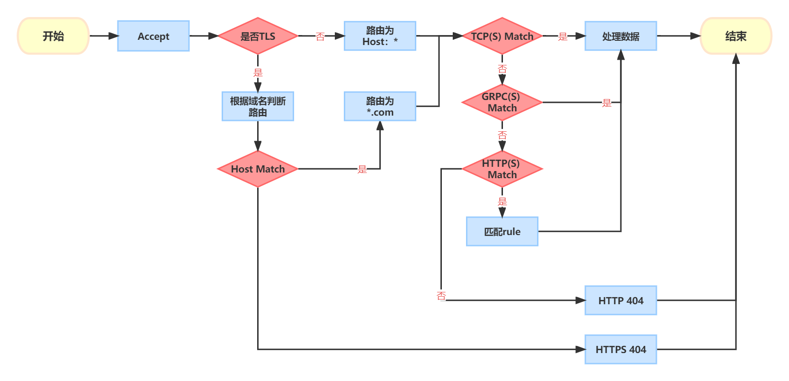

<h1 align="center">项目简介</h1>

<p align="center">
    开源的API网关服务，参考traefik和nginx设计，希望打造一个简单、易用、全平台的API网关项目。
</p>


<p align="center">
  <a href="https://github.com/ssbeatty/api_gateway/tree/main/configs">配置</a>
</p>

## 说明
目前项目仍在积极开发中。

### 相关文档
[benchmark](./docs/benchmark.md)

### 项目分为两个子项目
#### gateway
网关主体项目
#### backend
主要作为网关的一个config provider，同时实现一些辅助功能，简化配置工作量和使用成本。

#### cmd/server
集成网关和后端服务的命令。

### TODO
1. 管理界面的开发：
    1. 实现对当前API网关服务的配置，最大程度简化配置工作量
    2. ca的管理和通过ca签发证书的功能
    3. 对API指标的管理和监控：比如当前连接数、访问量
    4. 租户
2. 上游的类型增加服务注册中心
3. 测试当前的功能
4. 编写CI和文档等


### 目前已经实现的功能
1. HTTP(S)、TCP(TLS)、UDP、GRPC(TLS)的代理和转发，配置TLS后可以安全访问服务。
2. 端口的复用同一个端口可以支持多种协议，详情请看后文路由规则。
3. 多个配置Provider：文件和管理后端，且路由动态重载。
4. 上游服务负载均衡策略和健康检查（UDP没有健康检查）。
5. 4层中间件和7层中间件，详情可见后文中间件配置。

## 如何配置
### 配置路径

系统配置: `./config.yaml ~/api_gateway/config.yaml /etc/api_gateway/config.yaml`

端口配置: `./endpoints.yaml ~/api_gateway/endpoints.yaml /etc/api_gateway/endpoints.yaml`
### [项目通用配置](https://github.com/ssbeatty/api_gateway/blob/main/configs/config-example.yaml)
一般不需要修改，只列举常用功能。
```yaml
log:
  level: debug                             # 日志等级 默认为INFO
  path: stdout                             # 日志输出 可以为路径也可以为 stdout | stderr
  access_log:                              # access log
    enable: true
    httpLogPath: /path/http_access.log

gateway:                                   # 全局的配置参数
  graceTimeOut: 50ns                       # 程序结束后 关闭连接的等待时间
  listenUDPTimeOut: 10s                    # Listen UDP 的超时时间

  httpReadTimeout: 30s                     # HTTP读超时
  httpWriteTimeout: 30s                    # HTTP写超时
  httpIdleTimeout: 120s                    # HTTP连接超时
```

### File Provider的配置
[traefik路由参考](https://doc.traefik.io/traefik/routing/routers/#general)
```yaml
endpoints:                                 # 所有的端点 一个端点代表一个端口
  - name: tcp-1                            
    listen_port: 8080                      # 监听的端口
    type: tcp                              # tcp || udp
    routers:                               # 路由配置
      - type: http                         # 路由的类型 tcp || udp || grpc || http
        tls_enabled: true                  # 是否启用tls
        host: www.demo.com                 # 如果启用了tls 需要配置host
        rule: PathPrefix(`/`)              # 一般只有http需要配置 规则等同于traefik的http路由
        upstream:                          # 上游服务
          type: url                        # 服务类型  
          paths:
            - http://127.0.0.1:50051       # 服务地址
          load_balance: robin              # 负载均衡策略 random || robin || weight_robin || consistent_hash
        tls_config:                        # tls配置
          type: file                       # 配置中key的类型  file || bytes
          csr_file: demo.com.pem           # 地址或key字符
          key_file: demo.com-key.pem
          client_auth: NoClientCert        # 是否认证客户端
```
### 中间件的配置
TODO

## 路由的切换规则
项目支持端口复用，因此可以像如下同时配置http和https
```yaml
endpoints:
  - name: tcp-1
    listen_port: 8080
    type: tcp
    routers:
      - type: http
        tls_enabled: true
        rule: PathPrefix(`/`)
        upstream:
          type: url
          paths:
            - http://127.0.0.1:81
          load_balance: robin
      - type: http
        tls_enabled: true
        host: www.demo.com
        rule: PathPrefix(`/`)
        upstream:
          type: url
          paths:
            - http://127.0.0.1:81
          load_balance: robin
        tls_config:
          type: file
          csr_file: demo.com.pem
          key_file: demo.com-key.pem
          client_auth: NoClientCert
```
具体流程如下：


> 根据上图可以得到，同一个连接进来先判断是否为tls请求，不是则走http是则走https
> 但是grpc、tcp、http存在冲突，优先级为tcp > grpc > http
> http可以具备多个路由
> tls可以具备多个路由规则，只要域名不同即可